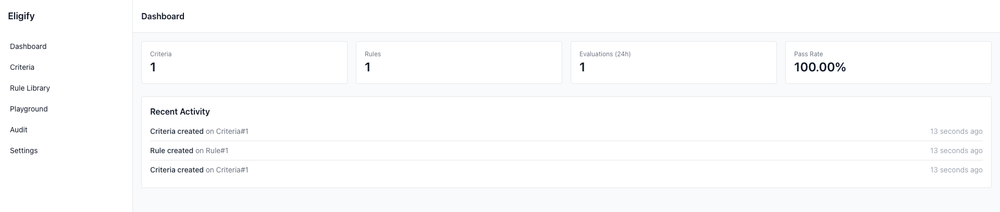

# Eligify

[](https://packagist.org/packages/cleaniquecoders/eligify) [](https://github.com/cleaniquecoders/eligify/actions?query=workflow%3Arun-tests+branch%3Amain) [](https://github.com/cleaniquecoders/eligify/actions?query=workflow%3A"Fix+PHP+code+style+issues"+branch%3Amain) [](https://packagist.org/packages/cleaniquecoders/eligify)

Eligify is a flexible rule and criteria engine that determines whether an entity — such as a person, application, or transaction — meets the defined acceptance conditions. It powers decision-making systems by making eligibility data-driven, traceable, and automatable.


## Features

- 🧱 **Criteria Builder** - Define eligibility requirements with weighted rules
- ⚖️ **Rule Engine** - 16+ operators for comprehensive validation
- 🎯 **Evaluator** - Real-time eligibility checks with detailed scoring
- 🔄 **Workflow Manager** - Trigger actions on pass/fail/excellent scores
- 🧾 **Audit Log** - Complete traceability of all decisions
- 🎨 **Web Dashboard** - Optional Telescope-style UI for management (disabled by default)
- 🧩 **Model Integration** - Seamless Laravel Eloquent integration
- 📊 **Flexible Scoring** - Weighted, pass/fail, percentage, and custom methods
- ⚡ **Smart Caching** - Built-in evaluation and rule compilation caching for optimal performance (experimental)
- 💾 **Multi-Driver Storage** - Store criteria/rules in database, local filesystem, or S3 with caching

## Installation

You can install the package via composer:

```bash
composer require cleaniquecoders/eligify
```

You can publish and run the migrations with:

```bash
php artisan vendor:publish --tag="eligify-migrations"
php artisan migrate
```

You can publish the config file with:

```bash
php artisan vendor:publish --tag="eligify-config"
```

## Usage

### Quick Example

```php
use CleaniqueCoders\Eligify\Facades\Eligify;

// Define criteria
$criteria = Eligify::criteria('Loan Approval')
->addRule('credit_score', '>=', 650, 30)
    ->addRule('annual_income', '>=', 30000, 25)
    ->addRule('debt_ratio',
'<=', 43, 20)
    ->passThreshold(70)
    ->save();

// Evaluate
$result = $criteria->evaluateWithCallbacks($data);
```

## Storage Drivers

By default, Eligify stores criteria and rules in the database. You can switch to file-based or S3 storage for scenarios where rules grow large or you prefer storing configuration outside the database.

| Driver | Description |
|--------|-------------|
| `database` | Default. Uses Eloquent models (zero change for existing users) |
| `file` | Stores each criteria as a JSON file on any Laravel filesystem disk |
| `s3` | Same as file driver, using an S3 disk |

> **Note:** Evaluations and audit logs always remain in the database regardless of the storage driver.

### Configuration

```php
// config/eligify.php
'storage' => [
    'driver' => env('ELIGIFY_STORAGE_DRIVER', 'database'),

    'file' => [
        'disk' => env('ELIGIFY_STORAGE_DISK', 'local'),
        'path' => env('ELIGIFY_STORAGE_PATH', 'eligify'),
    ],

    's3' => [
        'disk' => env('ELIGIFY_STORAGE_S3_DISK', 's3'),
        'path' => env('ELIGIFY_STORAGE_S3_PATH', 'eligify'),
    ],

    'cache' => [
        'enabled' => env('ELIGIFY_STORAGE_CACHE_ENABLED', true),
        'ttl' => env('ELIGIFY_STORAGE_CACHE_TTL', 1440), // minutes
        'prefix' => 'eligify_storage',
    ],
],
```

### Switching Storage Drivers

```bash
# .env
ELIGIFY_STORAGE_DRIVER=file
```

### Migrating Between Drivers

Export existing criteria from database to JSON files:

```bash
php artisan eligify:storage-export
```

Import JSON files into database:

```bash
php artisan eligify:storage-import
```

You can also target a specific criteria and disk:

```bash
php artisan eligify:storage-export loan-approval --disk=s3 --path=eligify
php artisan eligify:storage-import loan-approval --disk=s3 --path=eligify
```

## Security

Eligify includes built-in security features:

- **Input Validation**: All evaluation data is validated for length and suspicious content
- **Rate Limiting**: Configurable rate limits to prevent abuse
- **Authorization**: Dashboard access controlled via Gates/closures (similar to Telescope)
- **Audit Logging**: Complete audit trail of all evaluations and decisions
- **Safe Operators**: Dangerous operators like regex can be disabled in production

### Security Configuration

```php
// config/eligify.php
'security' => [
    'validate_input' => true,
    'max_field_length' => 255,
    'max_value_length' => 1000,
    'log_violations' => true,
],

'rate_limiting' => [
    'enabled' => true,
    'max_attempts' => 100,
    'decay_minutes' => 1,
],
```

### Dashboard Authorization

```php
// In AppServiceProvider
Gate::define('viewEligify', function ($user) {
    return $user->hasRole('admin');
});
```

## Performance

Eligify is optimized for high-performance scenarios:

- **Smart Caching**: Evaluation results and rule compilation caching
- **Eager Loading**: Optimized database queries to prevent N+1 problems
- **Batch Processing**: Efficient batch evaluation with memory management
- **Query Optimization**: Rules are loaded with criteria to minimize database hits

### Performance Configuration

```php
// config/eligify.php
'performance' => [
    'compile_rules' => true,
    'batch_size' => 100,
],

'evaluation' => [
    'cache_enabled' => true,
    'cache_ttl' => 60, // minutes
],
```

### Optional Web Dashboard

Enable the dashboard for visual management:

```bash
# .env
ELIGIFY_UI_ENABLED=true
```

**Access:** `http://your-app.test/eligify`



**Authorization (Production):**

```php
// AppServiceProvider.php
Gate::define('viewEligify', function ($user) {
    return $user->hasRole('admin');
});
```

### Complete Documentation

📖 **[Full Documentation](docs/README.md)**

## Testing

```bash
composer test
```

## Upgrade Guide

Please see [UPGRADE](UPGRADE.md) for step-by-step instructions when upgrading between versions.

## Changelog

Please see [CHANGELOG](CHANGELOG.md) for more information on what has changed recently.

## Contributing

Please see [CONTRIBUTING](CONTRIBUTING.md) for details.

## Security Vulnerabilities

Please review [our security policy](../../security/policy) on how to report security vulnerabilities.

## Credits

- [Nasrul Hazim Bin Mohamad](https://github.com/nasrulhazim)
- [All Contributors](../../contributors)

## License

The MIT License (MIT). Please see [License File](LICENSE.md) for more information.
