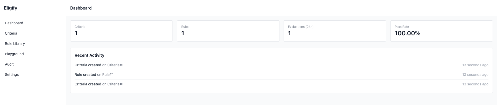

# Eligify Documentation

**Tagline:** "Define criteria. Enforce rules. Decide eligibility."

Eligify is a Laravel package that provides a flexible rule and criteria engine for determining entity eligibility. It makes eligibility decisions **data-driven**, **traceable**, and **automatable**.

## Table of Contents

- [Installation](#installation)
- [Quick Start](#quick-start)
- [Core Concepts](#core-concepts)
- [UI Dashboard](ui-setup-guide.md) 🎨
  - [Dynamic Field Selection](dynamic-field-selection.md) 🎯 **NEW**
- [Model Data Extraction](#model-data-extraction)
  - [Quick Reference Guide](quick-reference-model-extraction.md) ⚡
  - [Complete Guide](model-data-extraction.md) 📖
  - [Model Mappings](model-mappings.md) 🗺️
  - [Extractor Architecture](extractor-architecture.md) 🏗️
  - [Snapshot Data Object](snapshot.md) 📦
- [Configuration](#configuration)
  - [Configuration Guide](configuration.md) ⚙️
  - [Environment Variables](environment-variables.md) 🔧
- [Database Structure](#database-structure)
- [Usage Guide](#usage-guide)
- [Advanced Features](#advanced-features)
- [CLI Commands](#cli-commands)
- [Policy Integration](#policy-integration)
- [Testing](#testing)
- [Real-World Examples](#real-world-examples)

## Installation

Install the package via Composer:

```bash
composer require cleaniquecoders/eligify
```

Publish and run migrations:

```bash
php artisan vendor:publish --tag="eligify-migrations"
php artisan migrate
```

Publish configuration file:

```bash
php artisan vendor:publish --tag="eligify-config"
```

## Quick Start

Here's a simple loan approval example to get you started:

```php
use CleaniqueCoders\Eligify\Facades\Eligify;

// Step 1: Define criteria
$criteria = Eligify::criteria('loan_approval')
    ->description('Standard Personal Loan Approval')
    ->addRule('credit_score', '>=', 650, 30)      // 30% weight
    ->addRule('annual_income', '>=', 30000, 25)   // 25% weight
    ->addRule('debt_to_income_ratio', '<=', 43, 20) // 20% weight
    ->addRule('employment_status', 'in', ['employed', 'self-employed'], 15)
    ->addRule('active_loans', '<=', 3, 10)
    ->passThreshold(70)
    ->onPass(function($applicant, $result) {
        echo "✅ Loan Approved! Score: {$result['score']}%";
    })
    ->onFail(function($applicant, $result) {
        echo "❌ Loan Denied. Score: {$result['score']}%";
    })
    ->save();

// Step 2: Evaluate applicant
$result = Eligify::evaluate('loan_approval', [
    'credit_score' => 720,
    'annual_income' => 55000,
    'employment_status' => 'employed',
    'debt_to_income_ratio' => 35,
    'active_loans' => 2,
]);
```

**Result structure:**

```php
[
    'passed' => true,
    'score' => 85,
    'decision' => 'Approved',
    'failed_rules' => [],
    'criteria_id' => 1,
    'evaluation_id' => 123,
]
```

### Using the Web UI (Optional)

Eligify includes an optional dashboard for visual management:

```bash
# Enable in .env
ELIGIFY_UI_ENABLED=true

# Access at
http://your-app.test/eligify
```



**Features:**
- 📊 Visual criteria builder
- 🎮 Interactive testing playground
- 🔍 Audit log explorer
- ⚖️ Rule library management

> 📖 **Complete setup guide:** [UI Setup Guide](ui-setup-guide.md)

## Core Concepts

### 1. Criteria

A **Criteria** is a named collection of rules that define eligibility requirements for a specific use case (e.g., "loan_approval", "scholarship_eligibility").

**Key properties:**

- `name` - Human-readable name
- `slug` - Unique identifier (auto-generated from name)
- `description` - Detailed explanation of the criteria
- `is_active` - Enable/disable criteria
- `pass_threshold` - Minimum score required (0-100, default: 65)
- `meta` - Additional metadata (JSON)

**Example:**

```php
$criteria = Eligify::criteria('scholarship_eligibility')
    ->description('Merit-based scholarship qualification')
    ->passThreshold(80)
    ->save();
```

### 2. Rules

A **Rule** is a single condition that evaluates a field against a value using an operator.

**Components:**

- `field` - Data field to evaluate (e.g., 'credit_score')
- `operator` - Comparison operator (>=, <=, ==, !=, in, between, etc.)
- `value` - Expected value or threshold
- `weight` - Importance factor (default: 1, range: 1-10)
- `order` - Execution priority (default: 0)
- `is_active` - Enable/disable rule

**Example:**

```php
$criteria->addRule('gpa', '>=', 3.5, 8)           // Weight: 8
         ->addRule('age', 'between', [16, 25], 5)  // Weight: 5
         ->addRule('country', 'in', ['US', 'CA'], 3); // Weight: 3
```

### 3. Evaluation

An **Evaluation** is a recorded assessment of an entity against criteria.

**Stored data:**

- `criteria_id` - Which criteria was evaluated
- `evaluable_type/id` - Polymorphic relation to the entity
- `passed` - Boolean result
- `score` - Calculated score (0-100)
- `failed_rules` - Array of failed rule IDs
- `rule_results` - Detailed results per rule
- `decision` - Human-readable decision
- `context` - Input data provided
- `evaluated_at` - Timestamp

**Example:**

```php
// Automatic evaluation recording
$result = Eligify::evaluate('loan_approval', $data);

// Or evaluate against a model
$user = User::find(1);
$result = Eligify::evaluateModel($user, 'premium_membership');
```

### 4. Operators

Eligify supports 16 operators across different data types:

#### Numeric Comparisons

| Operator | Description | Example |
|----------|-------------|---------|
| `==` | Equal to | `->addRule('status', '==', 'active')` |
| `!=` | Not equal to | `->addRule('status', '!=', 'banned')` |
| `>` | Greater than | `->addRule('age', '>', 18)` |
| `>=` | Greater than or equal | `->addRule('score', '>=', 70)` |
| `<` | Less than | `->addRule('debt', '<', 10000)` |
| `<=` | Less than or equal | `->addRule('ratio', '<=', 0.43)` |

#### Array Operations

| Operator | Description | Example |
|----------|-------------|---------|
| `in` | Value in array | `->addRule('tier', 'in', ['gold', 'platinum'])` |
| `not_in` | Value not in array | `->addRule('status', 'not_in', ['banned', 'suspended'])` |

#### Range Operations

| Operator | Description | Example |
|----------|-------------|---------|
| `between` | Within range (inclusive) | `->addRule('age', 'between', [18, 65])` |
| `not_between` | Outside range | `->addRule('risk_score', 'not_between', [80, 100])` |

#### String Operations

| Operator | Description | Example |
|----------|-------------|---------|
| `contains` | String contains substring | `->addRule('email', 'contains', '@company.com')` |
| `starts_with` | String starts with | `->addRule('code', 'starts_with', 'ACC')` |
| `ends_with` | String ends with | `->addRule('email', 'ends_with', '.edu')` |

#### Existence Operations

| Operator | Description | Example |
|----------|-------------|---------|
| `exists` | Field has a value | `->addRule('profile_photo', 'exists', true)` |
| `not_exists` | Field is null/empty | `->addRule('deleted_at', 'not_exists', true)` |

#### Pattern Matching

| Operator | Description | Example |
|----------|-------------|---------|
| `regex` | Regex pattern match | `->addRule('phone', 'regex', '/^\+?[1-9]\d{1,14}$/')` |

### 5. Scoring Methods

Configure how scores are calculated using the `ScoringMethod` enum:

```php
use CleaniqueCoders\Eligify\Enums\ScoringMethod;

// Weighted average based on rule weights (default)
$criteria->scoringMethod(ScoringMethod::WEIGHTED);

// Binary pass/fail (100 if all pass, 0 if any fail)
$criteria->scoringMethod(ScoringMethod::PASS_FAIL);

// Sum of weights for passed rules
$criteria->scoringMethod(ScoringMethod::SUM);

// Simple average (all rules equal weight)
$criteria->scoringMethod(ScoringMethod::AVERAGE);

// Percentage of passed rules
$criteria->scoringMethod(ScoringMethod::PERCENTAGE);
```

### 6. Workflow Callbacks

Define actions to execute based on evaluation results:

```php
$criteria->onPass(function($data, $result) {
    // Execute when evaluation passes
    SendApprovalEmail::dispatch($data);
})
->onFail(function($data, $result) {
    // Execute when evaluation fails
    SendRejectionEmail::dispatch($data, $result['failed_rules']);
})
->onExcellent(function($data, $result) {
    // Execute when score >= 90
    OfferPremiumBenefits::dispatch($data);
})
->onGood(function($data, $result) {
    // Execute when 70 <= score < 90
    OfferStandardBenefits::dispatch($data);
});
```

## Model Data Extraction

Eligify provides a powerful **Model Data Extractor** system that automatically extracts and transforms data from your Eloquent models for eligibility evaluation. This makes it easy to evaluate models without manually mapping their attributes.

### Overview

The Model Data Extractor:

- **Extracts** basic model attributes
- **Computes** derived fields (age, duration, etc.)
- **Processes** relationships and aggregates
- **Applies** custom field mappings
- **Handles** sensitive data exclusion

### Quick Example

```php
use CleaniqueCoders\Eligify\Data\Extractor;

// Extract data from a User model
$user = User::with(['orders', 'subscriptions'])->find(1);
$extractor = Extractor::forModel('App\Models\User');
$data = $extractor->extract($user);

// Now evaluate with extracted data
$result = Eligify::evaluate('premium_membership', $data);
```

### Built-in Model Mappings

Eligify includes a default **UserModelMapping** that provides:

#### Field Mappings

```php
'email_verified_at' => 'email_verified_timestamp'
'created_at' => 'registration_date'
```

#### Computed Fields

- `is_verified` - Email verification status

### Using the Extractor

#### Basic Usage

```php
$extractor = new Extractor();
$data = $extractor->extract($user);

// Extracted data includes:
// - All model attributes
// - Computed timestamp fields (account_age_days, etc.)
// - Relationship counts and summaries
// - Custom computed fields
```

#### Model-Specific Extractor

```php
// Use preconfigured extractor for User models
$extractor = Extractor::forModel('App\Models\User');
$data = $extractor->extract($user);

// Results include UserModelMapping computed fields:
// [
//     'name' => 'John Doe',
//     'email' => 'john@example.com',
//     'registration_date' => '2024-01-15 10:30:00',
//     'is_verified' => true,
//     'total_orders' => 15,
//     'lifetime_value' => 2500.00,
//     'customer_tier' => 'gold',
//     'account_age_days' => 287,
//     ...
// ]
```

#### Direct Model Evaluation

```php
// Add HasEligibility trait to your model
class User extends Model
{
    use \CleaniqueCoders\Eligify\Concerns\HasEligibility;
}

// The trait automatically uses the extractor
$result = $user->evaluateEligibility('premium_membership');
```

> **💡 See It In Action**: Check out [Example 11: User Account Verification](../examples/11-user-account-verification.php) for a complete demonstration of UserModelMapping with real user evaluation scenarios.

### Creating Custom Mappings

Create your own model mapping classes for custom extraction logic.

#### 1. Create Mapping Class

```php
namespace App\Eligify\Mappings;

use CleaniqueCoders\Eligify\Mappings\AbstractModelMapping;

class CustomerModelMapping extends AbstractModelMapping
{
    public function getModelClass(): string
    {
        return 'App\Models\Customer';
    }

    protected array $fieldMappings = [
        'created_at' => 'customer_since',
        'last_login_at' => 'last_activity',
    ];

    public function __construct()
    {
        $this->computedFields = [
            // Relationship count
            'total_orders' => fn($m) => $this->safeRelationshipCount($m, 'orders'),

            // Relationship sum
            'total_spent' => fn($m) => $this->safeRelationshipSum($m, 'orders', 'total'),

            // Relationship average
            'avg_order_value' => fn($m) => $this->safeRelationshipAvg($m, 'orders', 'total'),

            // Complex logic
            'loyalty_tier' => function($m) {
                $spent = $this->safeRelationshipSum($m, 'orders', 'total');
                return match(true) {
                    $spent >= 10000 => 'platinum',
                    $spent >= 5000 => 'gold',
                    $spent >= 1000 => 'silver',
                    default => 'bronze'
                };
            },

            // Date calculations
            'last_purchase_days' => function($m) {
                $date = $this->safeRelationshipMax($m, 'orders', 'created_at');
                return $date ? now()->diffInDays($date) : null;
            },
        ];
    }
}
```

#### 2. Register in Config

Add your mapping to `config/eligify.php`:

```php
'model_extraction' => [
    'model_mappings' => [
        'App\Models\User' => \CleaniqueCoders\Eligify\Mappings\UserModelMapping::class,
        'App\Models\Customer' => \App\Eligify\Mappings\CustomerModelMapping::class,
    ],
],
```

#### 3. Use Your Mapping

```php
$customer = Customer::with('orders')->find(1);
$extractor = Extractor::forModel('App\Models\Customer');
$data = $extractor->extract($customer);

// Evaluate with extracted data
$result = Eligify::evaluate('vip_program', $data);
```

### Available Helper Methods

The `AbstractModelMapping` provides safe helper methods:

```php
// Relationship checks
$this->safeRelationshipCheck($model, 'subscriptions', 'active')
$this->hasRelationship($model, 'orders')

// Relationship counts
$this->safeRelationshipCount($model, 'orders')

// Relationship aggregates
$this->safeRelationshipSum($model, 'orders', 'total')
$this->safeRelationshipAvg($model, 'orders', 'rating')
$this->safeRelationshipMax($model, 'orders', 'created_at')
$this->safeRelationshipMin($model, 'orders', 'total')

// Safe data access
$this->getRelationshipData($model, 'profile', [])
```

### Configuration Options

Configure extraction behavior in `config/eligify.php`:

```php
'model_extraction' => [
    // Include timestamp-based computed fields
    'include_timestamps' => true,

    // Include relationship data and counts
    'include_relationships' => true,

    // Include computed fields
    'include_computed_fields' => true,

    // Maximum depth for relationship extraction
    'max_relationship_depth' => 2,

    // Exclude sensitive fields
    'exclude_sensitive_fields' => true,
    'sensitive_fields' => [
        'password',
        'remember_token',
        'api_token',
        'secret',
    ],

    // Date format
    'date_format' => 'Y-m-d H:i:s',

    // Model mappings
    'model_mappings' => [
        'App\Models\User' => \CleaniqueCoders\Eligify\Mappings\UserModelMapping::class,
    ],
],
```

### Automatic Field Extraction

The extractor automatically provides:

#### Timestamp Fields

- `created_days_ago` - Days since creation
- `created_months_ago` - Months since creation
- `created_years_ago` - Years since creation
- `account_age_days` - Alias for created_days_ago
- `updated_days_ago` - Days since last update
- `last_activity_days` - Alias for updated_days_ago

#### Relationship Data

For each loaded relationship:

- `{relation}_count` - Number of related records
- `{relation}_exists` - Boolean: has related records
- `{relation}_{field}_sum` - Sum of numeric field
- `{relation}_{field}_avg` - Average of numeric field
- `{relation}_{field}_max` - Maximum value
- `{relation}_{field}_min` - Minimum value
- `{relation}_{date}_latest` - Most recent date
- `{relation}_{date}_earliest` - Oldest date

### Example: E-commerce Eligibility

```php
// Define criteria using extracted fields
Eligify::criteria('vip_customer_program')
    ->addRule('customer_tier', 'in', ['gold', 'platinum'], 30)
    ->addRule('lifetime_value', '>=', 5000, 25)
    ->addRule('total_orders', '>=', 10, 20)
    ->addRule('account_age_days', '>=', 180, 15)
    ->addRule('last_order_days_ago', '<=', 90, 10)
    ->passThreshold(70)
    ->save();

// Evaluate customer
$customer = Customer::with('orders')->find(1);
$extractor = Extractor::forModel('App\Models\Customer');
$data = $extractor->extract($customer);

$result = Eligify::evaluate('vip_customer_program', $data);

if ($result['passed']) {
    $customer->assignVipStatus();
}
```

### Best Practices

1. **Eager Load Relationships**: Always eager load relationships before extraction to avoid N+1 queries

   ```php
   $user = User::with(['orders', 'subscriptions', 'profile'])->find(1);
   ```

2. **Create Specific Mappings**: Create model-specific mappings for frequently evaluated models

3. **Use Safe Helpers**: Always use the safe helper methods to prevent errors

4. **Cache Extracted Data**: Cache expensive computations if evaluating multiple criteria

5. **Test Your Mappings**: Write tests for custom mapping classes

For detailed documentation on creating custom model mappings, see [Model Mappings Guide](model-mappings.md).

## Configuration

The `config/eligify.php` file contains comprehensive settings for customizing the package behavior.

### Scoring Configuration

```php
'scoring' => [
    'pass_threshold' => 65,      // Default minimum score to pass
    'max_score' => 100,          // Maximum possible score
    'min_score' => 0,            // Minimum possible score
    'method' => 'weighted',      // Default scoring method
    'failure_penalty' => 5,      // Penalty per failed rule
    'excellence_bonus' => 10,    // Bonus for exceptional scores
],
```

### Audit Configuration

```php
'audit' => [
    'enabled' => true,           // Enable audit logging
    'events' => [                // Events to log
        'evaluation_completed',
        'rule_created',
        'criteria_activated',
        'criteria_deactivated',
        'rule_modified',
    ],
    'auto_cleanup' => true,      // Auto-delete old logs
    'retention_days' => 365,     // How long to keep logs
    'cleanup_schedule' => 'daily', // Cleanup frequency
],
```

### Performance Settings

```php
'performance' => [
    'optimize_queries' => true,       // Enable query optimization
    'batch_size' => 100,              // Batch processing size
    'compile_rules' => true,          // Pre-compile rules
    'compilation_cache_ttl' => 1440,  // Cache TTL in minutes (24h)
],
```

### Workflow Configuration

```php
'workflow' => [
    'max_steps' => 50,              // Maximum workflow steps
    'timeout' => 30,                // Timeout in seconds
    'retry_on_failure' => false,    // Retry failed workflows
    'fail_on_callback_error' => true, // Fail if callback throws
    'log_callback_errors' => true,  // Log callback exceptions
],
```

### Common Presets

Pre-configured criteria templates for common use cases:

```php
'presets' => [
    'loan_approval' => [
        'name' => 'Loan Approval',
        'pass_threshold' => 70,
        'rules' => [
            ['field' => 'credit_score', 'operator' => '>=', 'value' => 650, 'weight' => 8],
            ['field' => 'income', 'operator' => '>=', 'value' => 30000, 'weight' => 7],
            ['field' => 'debt_to_income_ratio', 'operator' => '<=', 'value' => 43, 'weight' => 6],
            ['field' => 'employment_status', 'operator' => 'in', 'value' => ['employed', 'self-employed'], 'weight' => 5],
        ],
    ],
    // ... more presets
],
```

## Database Structure

### Tables Overview

Eligify creates four main tables:

1. **eligify_criteria** - Stores criteria definitions
2. **eligify_rules** - Stores individual rules within criteria
3. **eligify_evaluations** - Records evaluation results
4. **eligify_audit_logs** - Comprehensive audit trail

### Criteria Table

```sql
eligify_criteria
├── id (bigint, primary key)
├── uuid (uuid, unique, indexed)
├── name (varchar) - Display name
├── slug (varchar, unique) - URL-friendly identifier
├── description (text, nullable)
├── is_active (boolean, default: true)
├── meta (json, nullable) - Additional metadata
└── timestamps (created_at, updated_at)
```

**Indexes:**

- `uuid` (unique)
- `slug` (unique)
- `name, is_active` (composite)

### Rules Table

```sql
eligify_rules
├── id (bigint, primary key)
├── uuid (uuid, unique, indexed)
├── criteria_id (foreign key → eligify_criteria)
├── field (varchar) - Field name to evaluate
├── operator (varchar) - Comparison operator
├── value (json) - Expected value (supports arrays)
├── weight (integer, default: 1) - Rule importance
├── order (integer, default: 0) - Execution order
├── is_active (boolean, default: true)
├── meta (json, nullable)
└── timestamps (created_at, updated_at)
```

**Indexes:**

- `uuid` (unique)
- `criteria_id, is_active` (composite)
- `field, operator` (composite)

**Foreign Keys:**

- `criteria_id` cascades on delete

### Evaluations Table

```sql
eligify_evaluations
├── id (bigint, primary key)
├── uuid (uuid, unique, indexed)
├── criteria_id (foreign key → eligify_criteria)
├── evaluable_type (varchar, nullable) - Polymorphic type
├── evaluable_id (bigint, nullable) - Polymorphic ID
├── passed (boolean, indexed)
├── score (decimal 8,2, default: 0)
├── failed_rules (json, nullable) - IDs of failed rules
├── rule_results (json, nullable) - Detailed per-rule results
├── decision (varchar, nullable) - Human-readable decision
├── context (json, nullable) - Input data
├── meta (json, nullable)
├── evaluated_at (timestamp)
└── timestamps (created_at, updated_at)
```

**Indexes:**

- `uuid` (unique)
- `evaluable_type, evaluable_id` (composite)
- `passed, evaluated_at` (composite)
- `criteria_id, passed` (composite)

### Audit Logs Table

```sql
eligify_audit_logs
├── id (bigint, primary key)
├── uuid (uuid, unique, indexed)
├── event (varchar) - Event type
├── auditable_type (varchar) - Polymorphic type
├── auditable_id (bigint) - Polymorphic ID
├── old_values (json, nullable) - Previous state
├── new_values (json, nullable) - New state
├── context (json, nullable) - Additional context
├── user_type (varchar, nullable) - User polymorphic type
├── user_id (bigint, nullable) - User ID
├── ip_address (varchar, nullable)
├── user_agent (varchar, nullable)
├── meta (json, nullable)
└── timestamps (created_at, updated_at)
```

**Indexes:**

- `uuid` (unique)
- `auditable_type, auditable_id` (composite)
- `event, created_at` (composite)
- `user_type, user_id` (composite)

## Usage Guide

### Creating Criteria

#### Basic Criteria

```php
use CleaniqueCoders\Eligify\Facades\Eligify;

$criteria = Eligify::criteria('basic_eligibility')
    ->description('Basic eligibility requirements')
    ->addRule('age', '>=', 18)
    ->addRule('country', 'in', ['US', 'CA', 'UK'])
    ->save();
```

#### Weighted Criteria

```php
$criteria = Eligify::criteria('weighted_loan')
    ->description('Weighted loan approval')
    ->addRule('credit_score', '>=', 650, 40)  // 40% weight
    ->addRule('income', '>=', 30000, 30)       // 30% weight
    ->addRule('employment', '==', 'active', 20) // 20% weight
    ->addRule('debt_ratio', '<=', 0.43, 10)    // 10% weight
    ->passThreshold(75)
    ->save();
```

#### With Callbacks

```php
$criteria = Eligify::criteria('membership_upgrade')
    ->addRule('tenure_months', '>=', 6)
    ->addRule('payment_history', '==', 'good')
    ->onPass(function($user, $result) {
        $user->upgradeMembership();
        Notification::send($user, new MembershipUpgraded($result));
    })
    ->onFail(function($user, $result) {
        Log::info('Membership upgrade denied', [
            'user_id' => $user->id,
            'score' => $result['score'],
            'failed_rules' => $result['failed_rules'],
        ]);
    })
    ->save();
```

### Evaluating Criteria

#### Simple Evaluation

```php
$result = Eligify::evaluate('loan_approval', [
    'credit_score' => 720,
    'income' => 55000,
    'employment' => 'active',
    'debt_ratio' => 0.35,
]);

if ($result['passed']) {
    echo "Approved with score: {$result['score']}%";
} else {
    echo "Denied. Failed rules: " . count($result['failed_rules']);
}
```

#### Model-based Evaluation

```php
// Add HasEligibility trait to your model
class User extends Model
{
    use \CleaniqueCoders\Eligify\Concerns\HasEligibility;
}

// Evaluate user (automatically extracts model data)
$user = User::find(1);
$result = $user->evaluateEligibility('premium_membership');

// Or use facade
$result = Eligify::evaluateModel($user, 'premium_membership');

// Manual extraction for more control
$extractor = Extractor::forModel('App\Models\User');
$data = $extractor->extract($user);
$result = Eligify::evaluate('premium_membership', $data);
```

> **Note**: Model-based evaluation automatically uses the [Model Data Extractor](#model-data-extraction) to extract and compute fields. See the Model Data Extraction section for details on creating custom mappings.

#### Batch Evaluation

```php
$users = User::whereIn('id', [1, 2, 3, 4, 5])->get();

$results = Eligify::evaluateBatch('loan_approval', $users->map(function($user) {
    return [
        'credit_score' => $user->credit_score,
        'income' => $user->annual_income,
        'employment' => $user->employment_status,
    ];
})->toArray());

foreach ($results as $index => $result) {
    echo "User {$users[$index]->name}: " . ($result['passed'] ? 'PASS' : 'FAIL') . "\n";
}
```

### Dynamic Criteria

Create criteria on-the-fly without persisting:

```php
$result = Eligify::evaluateDynamic([
    'age' => 25,
    'country' => 'US',
    'verified' => true,
], function($builder) {
    $builder->addRule('age', '>=', 18)
           ->addRule('country', 'in', ['US', 'CA'])
           ->addRule('verified', '==', true)
           ->passThreshold(100); // All rules must pass
});
```

### Retrieving Evaluations

```php
use CleaniqueCoders\Eligify\Models\Evaluation;

// Get all evaluations for a criteria
$evaluations = Evaluation::where('criteria_id', $criteriaId)->get();

// Get recent passed evaluations
$passed = Evaluation::where('passed', true)
    ->orderBy('evaluated_at', 'desc')
    ->limit(10)
    ->get();

// Get evaluations for a specific model
$userEvaluations = Evaluation::where('evaluable_type', User::class)
    ->where('evaluable_id', $userId)
    ->get();

// Get evaluations with failed rules
$failed = Evaluation::where('passed', false)
    ->whereNotNull('failed_rules')
    ->get();
```

## Advanced Features

### Model Data Extraction & Mappings

Create custom model mapping classes to define how data is extracted from your Eloquent models. This allows you to:

- Transform model attributes before evaluation
- Create computed fields based on relationships
- Add domain-specific business logic
- Reuse extraction logic across multiple criteria

```php
// Create custom mapping
class OrderModelMapping extends AbstractModelMapping
{
    public function getModelClass(): string
    {
        return 'App\Models\Order';
    }

    public function __construct()
    {
        $this->fieldMappings = [
            'created_at' => 'order_date',
        ];

        $this->computedFields = [
            'order_value_category' => fn($m) => match(true) {
                $m->total >= 1000 => 'high',
                $m->total >= 500 => 'medium',
                default => 'low'
            },
            'days_since_order' => fn($m) => now()->diffInDays($m->created_at),
        ];
    }
}
```

See the [Model Data Extraction](#model-data-extraction) section and [Model Mappings Guide](model-mappings.md) for complete documentation.

### Custom Scoring Methods

Implement custom scoring logic:

```php
use CleaniqueCoders\Eligify\Engine\RuleEngine;

class CustomScoringEngine extends RuleEngine
{
    protected function calculateScore(array $ruleResults): int
    {
        // Your custom scoring logic
        $score = 0;
        foreach ($ruleResults as $result) {
            if ($result['passed']) {
                $score += $result['rule']->weight * 2; // Double weight bonus
            }
        }
        return min($score, 100);
    }
}

// Use custom engine
app()->bind(RuleEngine::class, CustomScoringEngine::class);
```

### Advanced Rule Engine

Use the advanced engine for complex scenarios:

```php
use CleaniqueCoders\Eligify\Engine\AdvancedRuleEngine;

$engine = new AdvancedRuleEngine();

// Set custom options
$engine->setOption('parallel_execution', true)
       ->setOption('cache_results', true)
       ->setOption('optimization_level', 'aggressive');

$result = $engine->evaluate($criteria, $data);

// Get execution plan
$plan = $engine->getExecutionPlan($criteria);
```

### Conditional Rules

Create rules with dependencies:

```php
$criteria->addRule('age', '>=', 18)
         ->addRule('has_guardian', '==', true)
         ->addConditionalRule(
             condition: fn($data) => $data['age'] < 21,
             rule: ['field' => 'parental_consent', 'operator' => '==', 'value' => true]
         );
```

### Rule Groups

Group related rules for better organization:

```php
$criteria->addRuleGroup('financial_requirements', [
    ['field' => 'income', 'operator' => '>=', 'value' => 30000, 'weight' => 5],
    ['field' => 'credit_score', 'operator' => '>=', 'value' => 650, 'weight' => 5],
    ['field' => 'debt_ratio', 'operator' => '<=', 'value' => 0.43, 'weight' => 3],
])
->addRuleGroup('identity_verification', [
    ['field' => 'ssn_verified', 'operator' => '==', 'value' => true, 'weight' => 8],
    ['field' => 'address_verified', 'operator' => '==', 'value' => true, 'weight' => 7],
]);
```

### Audit Trail

Track all eligibility evaluations:

```php
use CleaniqueCoders\Eligify\Models\AuditLog;

// Get audit logs for a specific evaluation
$logs = AuditLog::where('auditable_type', Evaluation::class)
    ->where('auditable_id', $evaluationId)
    ->orderBy('created_at', 'desc')
    ->get();

// Get user activity
$userLogs = AuditLog::where('user_type', User::class)
    ->where('user_id', $userId)
    ->where('event', 'evaluation_completed')
    ->get();

// Get logs by event type
$ruleChanges = AuditLog::where('event', 'rule_modified')
    ->with('auditable')
    ->get();
```

### Custom Events

Listen to Eligify events:

```php
// In EventServiceProvider
protected $listen = [
    \CleaniqueCoders\Eligify\Events\EvaluationCompleted::class => [
        \App\Listeners\SendEligibilityNotification::class,
    ],
    \CleaniqueCoders\Eligify\Events\CriteriaCreated::class => [
        \App\Listeners\LogCriteriaCreation::class,
    ],
    \CleaniqueCoders\Eligify\Events\RuleExecuted::class => [
        \App\Listeners\TrackRulePerformance::class,
    ],
];
```

## CLI Commands

Eligify provides several Artisan commands for management and monitoring.

### Status Command

View package status and recent criteria:

```bash
php artisan eligify status
```

Output:

```
🎯 Eligify Package Status

Component      Count  Status
────────────────────────────────
Criteria       12     ✅ Active
Rules          48     ✅ Active
Evaluations    1,234  ✅ Active
Audit Logs     5,678  ✅ Active

📋 Recent Criteria:
Name                    Slug                    Rules      Status     Created
────────────────────────────────────────────────────────────────────────────────
Loan Approval          loan-approval           5 rules    ✅ Active  2025-10-27
Scholarship            scholarship             8 rules    ✅ Active  2025-10-26
```

### Statistics Command

View detailed statistics:

```bash
php artisan eligify stats
```

### Health Check

Run system health checks:

```bash
php artisan eligify health
```

### Criteria Management

Create criteria via CLI:

```bash
php artisan eligify:criteria create
```

List all criteria:

```bash
php artisan eligify:criteria list
```

Deactivate criteria:

```bash
php artisan eligify:criteria deactivate loan-approval
```

### Evaluate Command

Evaluate criteria from command line:

```bash
php artisan eligify:evaluate loan-approval --data='{"credit_score":720,"income":55000}'
```

Interactive evaluation:

```bash
php artisan eligify:evaluate loan-approval --interactive
```

### Audit Management

Query audit logs:

```bash
# All logs
php artisan eligify:audit

# Specific event
php artisan eligify:audit --event=evaluation_completed

# Date range
php artisan eligify:audit --from=2025-10-01 --to=2025-10-27

# Export to CSV
php artisan eligify:audit --export=audits.csv
```

Clean up old logs:

```bash
# Clean logs older than 365 days
php artisan eligify:cleanup-audit

# Custom retention
php artisan eligify:cleanup-audit --days=90

# Dry run
php artisan eligify:cleanup-audit --dry-run
```

## Policy Integration

Integrate Eligify with Laravel policies for authorization. See [Policy Integration Guide](policy-integration.md) for detailed documentation.

### Basic Integration

```php
use CleaniqueCoders\Eligify\Concerns\HasEligibility;

class UserPolicy
{
    use HasEligibility;

    public function updateProfile(User $user)
    {
        return $this->hasEligibility($user, 'profile_update_eligibility');
    }

    public function accessPremiumFeatures(User $user)
    {
        return $this->hasMinimumScore($user, 'premium_eligibility', 80);
    }
}
```

### Advanced Policy Usage

```php
public function applyForLoan(User $user)
{
    $result = $this->checkEligibility($user, 'loan_approval');

    if (!$result['passed']) {
        return Response::deny(
            'You do not meet the loan approval criteria. ' .
            'Score: ' . $result['score'] . '%'
        );
    }

    return Response::allow();
}
```

## Testing

### Factory Usage

Eligify provides factories for all models:

```php
use CleaniqueCoders\Eligify\Models\Criteria;
use CleaniqueCoders\Eligify\Models\Rule;

// Create criteria with rules
$criteria = Criteria::factory()
    ->has(Rule::factory()->count(5))
    ->create([
        'name' => 'Test Criteria',
        'pass_threshold' => 75,
    ]);

// Create evaluation
$evaluation = Evaluation::factory()
    ->for($criteria)
    ->for($user, 'evaluable')
    ->create([
        'passed' => true,
        'score' => 85,
    ]);
```

### Testing Criteria

```php
use CleaniqueCoders\Eligify\Facades\Eligify;

test('loan approval passes for qualified applicant', function () {
    $criteria = Eligify::criteria('test_loan')
        ->addRule('credit_score', '>=', 650)
        ->addRule('income', '>=', 30000)
        ->passThreshold(70)
        ->save();

    $result = Eligify::evaluate('test_loan', [
        'credit_score' => 720,
        'income' => 55000,
    ]);

    expect($result['passed'])->toBeTrue();
    expect($result['score'])->toBeGreaterThan(70);
});
```

### Mocking Evaluations

```php
use CleaniqueCoders\Eligify\Facades\Eligify;

test('handles failed evaluation', function () {
    Eligify::shouldReceive('evaluate')
        ->once()
        ->with('loan_approval', Mockery::any())
        ->andReturn([
            'passed' => false,
            'score' => 45,
            'failed_rules' => [/* ... */],
        ]);

    // Your test code
});
```

## Real-World Examples

The `examples/` directory contains 11 comprehensive real-world examples:

1. **[Loan Approval](../examples/01-loan-approval.php)** - Financial services loan decisioning
2. **[Scholarship Eligibility](../examples/02-scholarship-eligibility.php)** - Educational award qualification
3. **[Job Candidate Screening](../examples/03-job-candidate-screening.php)** - HR recruitment filtering
4. **[Insurance Underwriting](../examples/04-insurance-underwriting.php)** - Risk assessment and premium calculation
5. **[E-commerce Discount](../examples/05-e-commerce-discount-eligibility.php)** - Retail promotion eligibility
6. **[Government Aid](../examples/06-government-aid-qualification.php)** - Social services qualification
7. **[Gym Membership](../examples/07-gym-membership-tiers.php)** - Tiered subscription services
8. **[Credit Card Approval](../examples/08-credit-card-approval.php)** - Banking card approval tiers
9. **[Rental Screening](../examples/09-rental-application-screening.php)** - Property tenant qualification
10. **[SaaS Upgrade](../examples/10-saas-plan-upgrade-eligibility.php)** - Software subscription upgrades
11. **[User Account Verification](../examples/11-user-account-verification.php)** - UserModelMapping demonstration with account verification

### Featured Example: User Account Verification

This example demonstrates the power of **UserModelMapping** for automatic data extraction:

```php
use CleaniqueCoders\Eligify\Data\Extractor;

// Create criteria using UserModelMapping computed fields
$criteria = Eligify::criteria('verified_user_access')
    ->addRule('is_verified', '==', true, 40)           // Computed field
    ->addRule('account_age_days', '>=', 7, 30)         // Computed field
    ->addRule('registration_date', '<=', now(), 30)    // Mapped field
    ->passThreshold(70)
    ->save();

// Extract data automatically using UserModelMapping
$user = User::find(1);
$extractor = Extractor::forModel('App\Models\User');
$data = $extractor->extract($user);

// Evaluate with extracted data
$result = Eligify::evaluate('verified_user_access', $data);
```

The example shows:
- ✅ Automatic field mapping (`created_at` → `registration_date`)
- ✅ Computed fields (`is_verified`, `account_age_days`)
- ✅ Single and batch user evaluation
- ✅ Detailed rule-by-rule breakdown

Run any example:

```bash
php examples/01-loan-approval.php
```

## Best Practices

### 1. Naming Conventions

```php
// Use descriptive, unique names
Eligify::criteria('personal_loan_approval_tier_1')
    ->description('Personal loans up to $50,000 for tier 1 applicants');

// Avoid generic names
// ❌ Eligify::criteria('approval')
// ✅ Eligify::criteria('premium_membership_approval')
```

### 2. Weight Distribution

```php
// Ensure weights add up logically
$criteria->addRule('credit_score', '>=', 650, 40)   // Critical factor
         ->addRule('income', '>=', 30000, 30)        // Important
         ->addRule('employment', '!=', 'unemployed', 20)  // Moderate
         ->addRule('address_verified', '==', true, 10);   // Minor
```

### 3. Threshold Selection

```php
// Choose appropriate pass thresholds
->passThreshold(100)  // Perfect score required (strict)
->passThreshold(80)   // High bar (selective)
->passThreshold(65)   // Moderate bar (balanced)
->passThreshold(50)   // Low bar (lenient)
```

### 4. Error Handling

```php
try {
    $result = Eligify::evaluate('loan_approval', $data);
} catch (\InvalidArgumentException $e) {
    // Criteria not found
    Log::error('Criteria not found', ['name' => 'loan_approval']);
} catch (\Exception $e) {
    // Other evaluation errors
    Log::error('Evaluation failed', ['error' => $e->getMessage()]);
}
```

### 5. Performance Optimization

```php
// Enable caching in config
'performance' => [
    'optimize_queries' => true,
    'compile_rules' => true,
    'compilation_cache_ttl' => 1440,
],

// Eager load relationships
$criteria = Criteria::with('rules')->find($id);

// Batch evaluations instead of loops
$results = Eligify::batchEvaluate('criteria_name', $dataArray);
```

## Troubleshooting

### Common Issues

**Issue: Criteria not found**

```php
// Solution: Check slug format
$criteria = Criteria::where('slug', str('My Criteria')->slug())->first();
```

**Issue: Rules not evaluating correctly**

```php
// Solution: Verify data types match expectations
$result = Eligify::evaluate('test', [
    'age' => (int) $age,        // Ensure integer
    'income' => (float) $income, // Ensure float
]);
```

**Issue: Callbacks not executing**

```php
// Solution: Ensure criteria is saved before evaluation
$criteria->save();  // Must save first
$result = Eligify::evaluate('criteria_name', $data);
```

## Support

- **Documentation**: [https://github.com/cleaniquecoders/eligify/tree/main/docs](https://github.com/cleaniquecoders/eligify/tree/main/docs)
- **Issues**: [https://github.com/cleaniquecoders/eligify/issues](https://github.com/cleaniquecoders/eligify/issues)
- **Discussions**: [https://github.com/cleaniquecoders/eligify/discussions](https://github.com/cleaniquecoders/eligify/discussions)

## License

Eligify is open-sourced software licensed under the [MIT license](../LICENSE.md).
