# Extractor Architecture

This document explains how the `Extractor` fits into the overall Eligify architecture and data flow.

## System Overview

```mermaid
flowchart TB
    subgraph Input["📥 Input Layer"]
        Model[Your Eloquent Model<br/>User, LoanApplication, etc.]
    end

    subgraph Extraction["🔄 Data Extraction Layer"]
        MDE[Extractor]
        Config[Config File<br/>eligify.php]
        Mapping[Mapping Classes<br/>UserMapping, etc.]

        Config -.->|configures| MDE
        Mapping -.->|applies to| MDE
    end

    subgraph Processing["⚙️ Eligibility Processing"]
        FlatData[Flat Array<br/>All model data normalized]
        Rules[Rule Engine<br/>Evaluates criteria]
        Evaluator[Evaluator<br/>Runs checks]
    end

    subgraph Output["📤 Output Layer"]
        Result[Evaluation Result<br/>passed/failed + details]
        Actions[Workflows<br/>Callbacks triggered]
        Audit[Audit Logs<br/>Decision trail]
    end

    Model -->|extract| MDE
    MDE -->|produces| FlatData
    FlatData -->|feeds into| Rules
    Rules -->|checked by| Evaluator
    Evaluator -->|returns| Result
    Result -->|triggers| Actions
    Result -->|logged in| Audit

    style Model fill:#E3F2FD
    style MDE fill:#FFF9C4
    style FlatData fill:#C8E6C9
    style Result fill:#BBDEFB
```

## Data Extraction Pipeline

```mermaid
flowchart LR
    subgraph "1. Model"
        M[User Model<br/>Complex nested data]
    end

    subgraph "2. Extractor"
        E[Extractor<br/>Transforms & flattens]
    end

    subgraph "3. Flat Data"
        F[income: 5000<br/>credit_score: 720<br/>orders_count: 12<br/>account_age_days: 365]
    end

    subgraph "4. Rules"
        R[Income >= 3000<br/>Credit >= 650<br/>Orders >= 5<br/>Age >= 180]
    end

    subgraph "5. Result"
        Result[✅ All Passed<br/>Eligible: true]
    end

    M --> E
    E --> F
    F --> R
    R --> Result

    style M fill:#E3F2FD
    style E fill:#FFF9C4
    style F fill:#C8E6C9
    style R fill:#FFE082
    style Result fill:#A5D6A7
```

## Why Extractor Exists

### Problem: Complex Model Structures

## Configuration Hierarchy

## Usage Pattern Comparison

## Real-World Flow Example

Here's how a complete loan approval flow works with Extractor:

## Data Transformation Example

## Key Benefits

## Integration Points

## Summary

The `Extractor` is a critical bridge component that:

1. **Transforms** complex model structures into flat, rule-friendly arrays
2. **Standardizes** data extraction across different model types
3. **Centralizes** field mapping and computation logic
4. **Enables** consistent, testable, and maintainable eligibility rules

It sits between your Laravel models and the Eligify rule engine, making eligibility evaluation simple and powerful.

## Related Documentation

- [Quick Reference](quick-reference-model-extraction.md) - One-page usage guide
- [Complete Guide](model-data-extraction.md) - Detailed documentation with examples
- [Model Mappings](model-mappings.md) - How to create mapping classes
- [Configuration](configuration.md) - Config options
- [Usage Guide](usage-guide.md) - End-to-end examples
