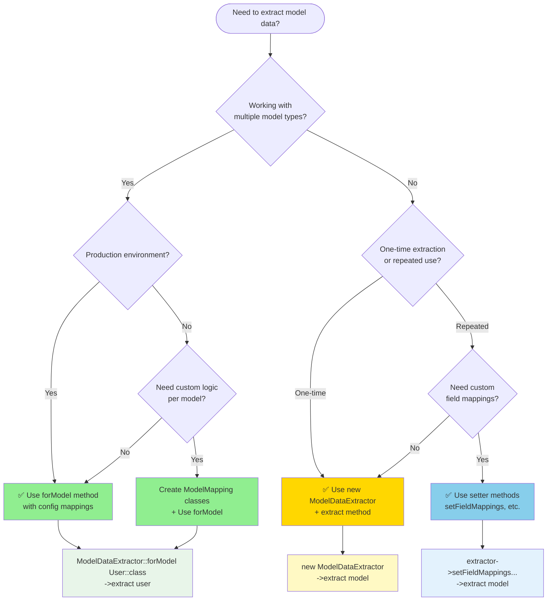
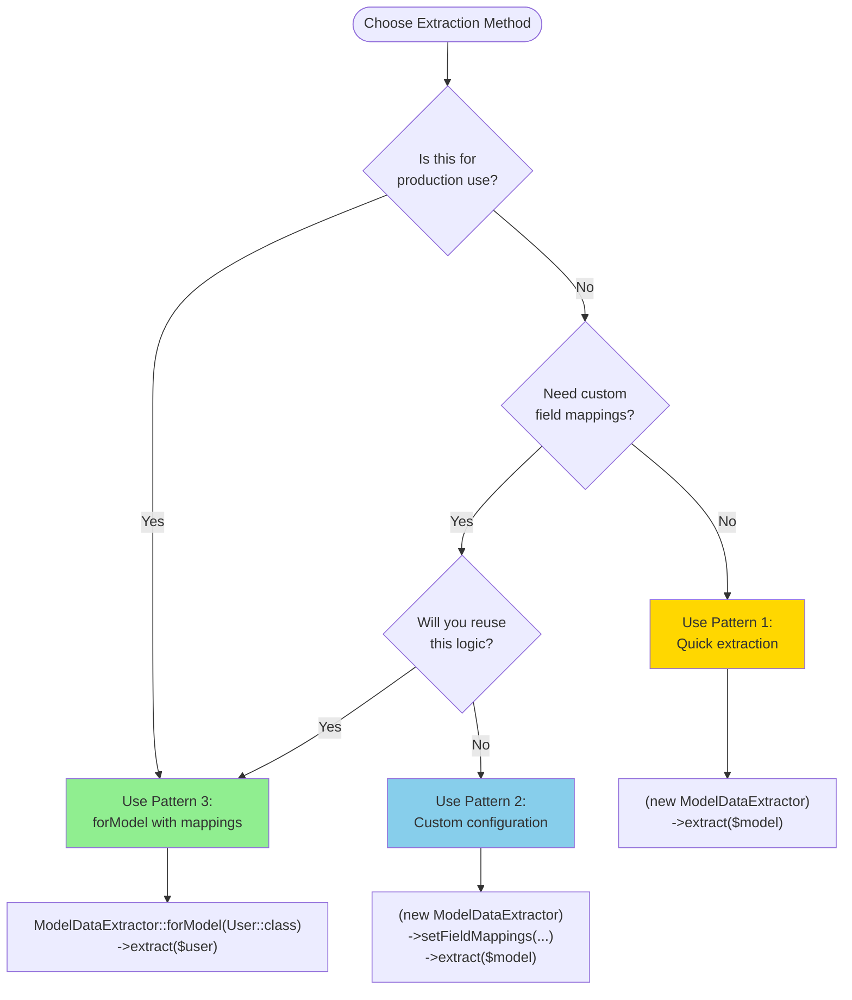
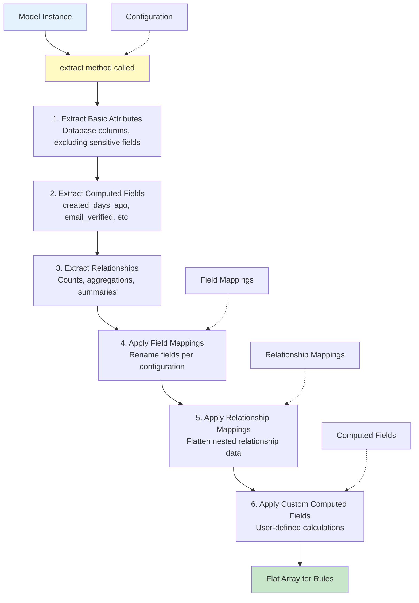

# Model Data Extraction Guide

The `ModelDataExtractor` class is responsible for transforming Laravel Eloquent models into flat arrays suitable for eligibility rule evaluation. This guide helps you choose the right approach for your use case.

## Quick Decision Guide



## Method Comparison

### 1. Quick Extraction (Simple Use Cases)

**When to use:**
- Prototyping or testing
- Simple models without custom requirements
- One-off extractions
- You want default behavior

**Example:**
```php
$extractor = new ModelDataExtractor();
$data = $extractor->extract($user);
```

**Pros:**
- ✅ Fastest to implement
- ✅ No configuration needed
- ✅ Good for quick tests

**Cons:**
- ❌ No customization
- ❌ Same config for all models
- ❌ Harder to maintain at scale

---

### 2. Custom Configuration (One-off Customization)

**When to use:**
- Need specific field mappings for a single extraction
- Adding computed fields on-the-fly
- Exploratory data analysis
- Non-production scripts

**Example:**
```php
$extractor = new ModelDataExtractor([
    'include_relationships' => true,
    'max_relationship_depth' => 3,
]);

$extractor
    ->setFieldMappings([
        'annual_income' => 'income',
        'credit_rating' => 'credit_score',
    ])
    ->setComputedFields([
        'debt_to_income_ratio' => fn($model, $data) =>
            $data['debt'] / $data['income'],
    ]);

$data = $extractor->extract($user);
```

**Pros:**
- ✅ Flexible per-extraction
- ✅ No config files needed
- ✅ Good for exploration

**Cons:**
- ❌ Configuration not reusable
- ❌ Duplicated logic across codebase
- ❌ Hard to maintain

---

### 3. Model-Specific Extractors (RECOMMENDED for Production)

**When to use:**
- Production applications
- Multiple model types with different extraction needs
- Team environments requiring consistency
- When you want centralized extraction logic

**Example:**

**Step 1: Configure in `config/eligify.php`**
```php
'model_extraction' => [
    'model_mappings' => [
        \App\Models\User::class => \App\Eligify\Mappings\UserMapping::class,
        \App\Models\LoanApplication::class => \App\Eligify\Mappings\LoanMapping::class,
    ],
    'default_mapping' => \App\Eligify\Mappings\DefaultMapping::class,
],
```

**Step 2: Create mapping class**
```php
namespace App\Eligify\Mappings;

use CleaniqueCoders\Eligify\Contracts\ModelMapping;
use CleaniqueCoders\Eligify\Support\ModelDataExtractor;

class UserMapping implements ModelMapping
{
    public function configure(ModelDataExtractor $extractor): ModelDataExtractor
    {
        return $extractor
            ->setFieldMappings([
                'annual_income' => 'income',
                'credit_rating' => 'credit_score',
            ])
            ->setRelationshipMappings([
                'profile' => [
                    'employment_status' => 'is_employed',
                ],
            ])
            ->setComputedFields([
                'risk_score' => fn($model) => $model->calculateRisk(),
            ]);
    }
}
```

**Step 3: Use in code**
```php
$data = ModelDataExtractor::forModel(User::class)->extract($user);
```

**Pros:**
- ✅ Centralized configuration
- ✅ Reusable across application
- ✅ Type-safe with model classes
- ✅ Easy to test and maintain
- ✅ Consistent extraction logic
- ✅ Version controlled

**Cons:**
- ❌ Requires initial setup
- ❌ More files to manage

---

## Usage Decision Tree



## Extraction Process Flow



## Real-World Examples

### Example 1: Loan Approval (Production)

```php
// config/eligify.php
'model_mappings' => [
    \App\Models\LoanApplication::class => \App\Eligify\Mappings\LoanMapping::class,
],

// app/Eligify/Mappings/LoanMapping.php
class LoanMapping implements ModelMapping
{
    public function configure(ModelDataExtractor $extractor): ModelDataExtractor
    {
        return $extractor->setFieldMappings([
            'requested_amount' => 'loan_amount',
            'monthly_income' => 'income',
        ])->setComputedFields([
            'debt_to_income_ratio' => function($model, $data) {
                $totalDebt = $data['loans_sum_amount'] ?? 0;
                return $totalDebt / $data['income'];
            },
        ]);
    }
}

// In your controller/service
$data = ModelDataExtractor::forModel(LoanApplication::class)
    ->extract($application);

// Use $data in eligibility rules
```

### Example 2: Quick Script (Development)

```php
// Quick one-off extraction for testing
$extractor = new ModelDataExtractor(['include_relationships' => false]);
$data = $extractor->extract($user);

// Inspect what data is available
dd($data);
```

### Example 3: Custom Report (Ad-hoc)

```php
// Generate a custom eligibility report with specific metrics
$extractor = (new ModelDataExtractor)
    ->setComputedFields([
        'eligibility_score' => function($model, $data) {
            $score = 0;
            $score += $data['income'] > 5000 ? 30 : 0;
            $score += $data['account_age_days'] > 180 ? 25 : 0;
            $score += $data['email_verified'] ? 20 : 0;
            $score += ($data['orders_count'] ?? 0) > 5 ? 25 : 0;
            return $score;
        },
    ]);

$results = collect($users)->map(fn($user) => [
    'user' => $user->name,
    'data' => $extractor->extract($user),
]);
```

## Best Practices

### ✅ Do's

1. **Use `forModel()` for production code**
   ```php
   // Good: Centralized, maintainable
   ModelDataExtractor::forModel(User::class)->extract($user)
   ```

2. **Create mapping classes for each model type**
   ```php
   // Good: Organized, reusable
   class UserMapping implements ModelMapping { ... }
   ```

3. **Keep computed fields pure and testable**
   ```php
   // Good: Simple, testable calculation
   'risk_score' => fn($model, $data) => ($data['income'] / $data['debt']) * 100
   ```

4. **Document your field mappings**
   ```php
   // Good: Clear documentation
   ->setFieldMappings([
       'annual_income' => 'income', // Rules expect 'income'
   ])
   ```

### ❌ Don'ts

1. **Don't duplicate extraction logic**
   ```php
   // Bad: Repeated in multiple places
   $extractor = new ModelDataExtractor();
   $extractor->setFieldMappings(['annual_income' => 'income']);
   // ... repeated everywhere
   ```

2. **Don't perform side effects in computed fields**
   ```php
   // Bad: Modifies database
   'score' => function($model) {
       $model->update(['last_scored' => now()]); // Don't do this!
       return $model->score;
   }
   ```

3. **Don't ignore sensitive data filtering**
   ```php
   // Bad: Exposes sensitive data
   new ModelDataExtractor(['exclude_sensitive_fields' => false])
   ```

4. **Don't nest extractors recursively**
   ```php
   // Bad: Can cause infinite loops
   'profile_data' => fn($model) =>
       ModelDataExtractor::forModel(Profile::class)->extract($model->profile)
   ```

## Summary Table

| Pattern | Use Case | Setup Time | Maintainability | Reusability | Production Ready |
|---------|----------|------------|-----------------|-------------|------------------|
| **Pattern 1: Quick** | Prototyping, testing | ⚡ Instant | ⭐ Low | ❌ No | ❌ No |
| **Pattern 2: Custom** | One-off scripts, exploration | ⏱️ Minutes | ⭐⭐ Medium | ⚠️ Limited | ⚠️ Maybe |
| **Pattern 3: forModel** | Production, teams | ⏰ Hours | ⭐⭐⭐ High | ✅ Yes | ✅ Yes |

## Further Reading

- [Model Mappings Documentation](model-mappings.md)
- [Configuration Guide](configuration.md)
- [Advanced Features](advanced-features.md)
- [Usage Guide](usage-guide.md)
