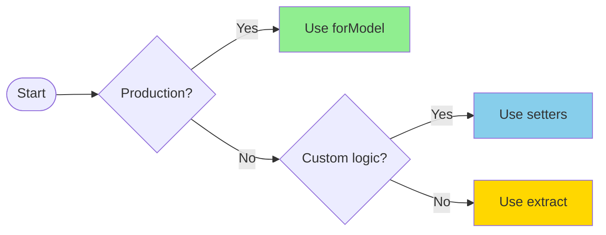
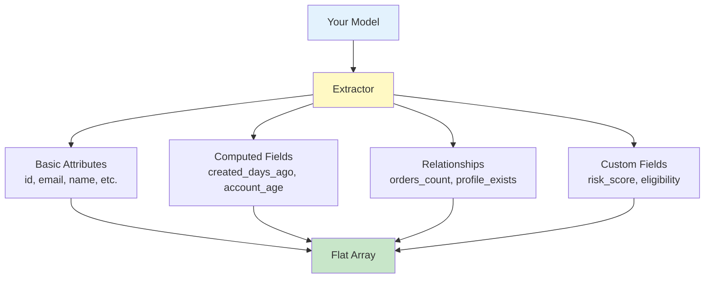

# Model Data Extraction - Quick Reference

## TL;DR - Which Method Should I Use?



## Three Patterns - Choose One

### 🥉 Pattern 1: Quick & Simple

```php
$data = (new Extractor())->extract($user);
```

**Use when:** Testing, prototyping, simple cases

### 🥈 Pattern 2: Custom Configuration

```php
$data = (new Extractor())
    ->setFieldMappings(['annual_income' => 'income'])
    ->setComputedFields(['risk' => fn($m) => $m->calculateRisk()])
    ->extract($user);
```

**Use when:** One-off scripts, need custom logic, exploration

### 🥇 Pattern 3: Production (RECOMMENDED)

```php
$data = Extractor::forModel(User::class)->extract($user);
```

**Use when:** Production, team projects, multiple model types

**Setup:** Configure once in `config/eligify.php`:

```php
'model_mappings' => [
    User::class => UserMapping::class,
]
```

## Method Reference Card

| Method | Purpose | Returns | When to Use |
|--------|---------|---------|-------------|
| `extract($model)` | Extracts data from model | `array` | Every time - this does the work |
| `forModel($class)` | Creates configured extractor | `self` | Production - creates the extractor |
| `setFieldMappings($map)` | Renames fields | `self` | Custom extraction needs |
| `setRelationshipMappings($map)` | Flattens relationships | `self` | Accessing nested data |
| `setComputedFields($fields)` | Adds calculations | `self` | Dynamic field generation |

## Code Examples

### Loan Approval Example

```php
// Production approach
$data = Extractor::forModel(LoanApplication::class)
    ->extract($application);

// Returns array like:
[
    'income' => 5000,
    'credit_score' => 720,
    'debt_to_income_ratio' => 0.35,
    'active_loans_count' => 2,
    'employment_verified' => true,
]
```

### User Verification Example

```php
// Quick test
$data = (new Extractor())->extract($user);

// Returns array like:
[
    'email_verified' => true,
    'created_days_ago' => 365,
    'orders_count' => 12,
    'orders_sum_amount' => 2500.00,
]
```

## What Gets Extracted?



## Common Pitfalls

❌ **Don't:** Create new extractor with same config everywhere

```php
// Bad - duplicated everywhere
$extractor = new Extractor();
$extractor->setFieldMappings(['annual_income' => 'income']);
$data = $extractor->extract($user);
```

✅ **Do:** Use forModel with centralized config

```php
// Good - configured once
$data = Extractor::forModel(User::class)->extract($user);
```

## See Full Documentation

For complete examples, decision trees, and best practices, see:
- [Model Data Extraction Guide](model-data-extraction.md) - Full guide with diagrams
- [Model Mappings](model-mappings.md) - How to create mapping classes
- [Configuration](configuration.md) - Config options
