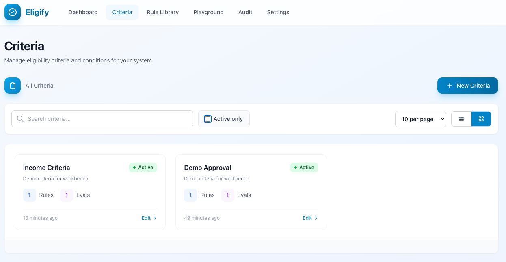
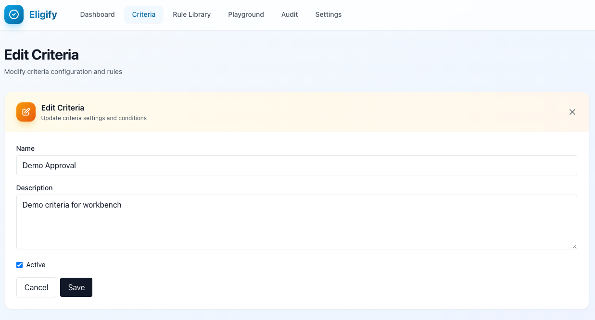
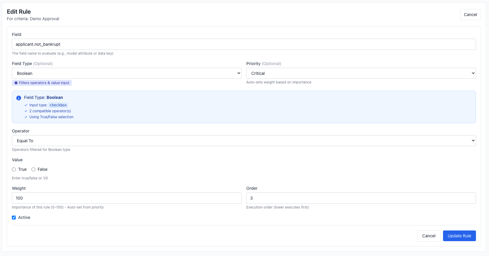
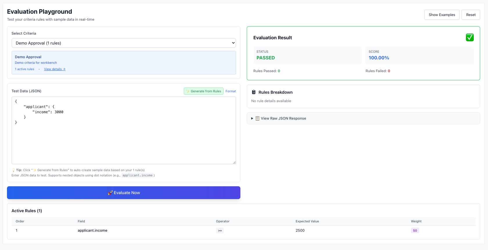
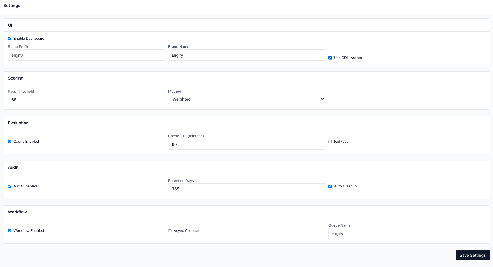

# UI Setup Guide

**Eligify Dashboard** provides a Telescope-style, opt-in web interface for managing criteria, rules, evaluations, and monitoring your eligibility system. This guide will help you configure and secure the UI for your application.


## Table of Contents

- [Overview](#overview)
- [Quick Start](#quick-start)
- [Configuration](#configuration)
  - [Enabling the Dashboard](#enabling-the-dashboard)
  - [Route Configuration](#route-configuration)
  - [Authorization](#authorization)
  - [Branding](#branding)
  - [Assets Configuration](#assets-configuration)
- [Authorization Strategies](#authorization-strategies)
- [Production Deployment](#production-deployment)
- [UI Features](#ui-features)
- [Troubleshooting](#troubleshooting)

---

## Overview

The Eligify Dashboard is **disabled by default** and must be explicitly enabled. It follows Laravel Telescope's authorization pattern, allowing you to control access via:

- **Gates** - Use Laravel's built-in Gate system
- **Custom Closures** - Define your own authorization logic
- **Environment-based** - Auto-allow in local, secure in production

**Key Features:**

- 📊 **Dashboard** - Real-time metrics and system overview
- 📋 **Criteria Manager** - Create, edit, and manage eligibility criteria
- ⚖️ **Rule Editor** - Visual rule builder with validation
- 🎮 **Playground** - Test criteria with live data
- 🔍 **Audit Logs** - Complete audit trail of all operations
- 📚 **Rule Library** - Reusable rule templates

---

## Quick Start

### 1. Enable the Dashboard

Add to your `.env` file:

```env
ELIGIFY_UI_ENABLED=true
```

### 2. Publish Configuration (Optional)

```bash
php artisan vendor:publish --tag="eligify-config"
```

### 3. Configure Authorization

**For Local Development** (auto-allowed):

```env
APP_ENV=local
```

**For Production**, define a Gate in `App\Providers\AppServiceProvider`:

```php
use Illuminate\Support\Facades\Gate;

public function boot(): void
{
    Gate::define('viewEligify', function ($user) {
        return in_array($user->email, [
            'admin@example.com',
            'developer@example.com',
        ]);
    });
}
```

### 4. Access the Dashboard

Visit: `http://your-app.test/eligify`

---

## Configuration

All UI configuration is located in `config/eligify.php` under the `ui` key.

### Enabling the Dashboard

```php
'ui' => [
    'enabled' => env('ELIGIFY_UI_ENABLED', false),
    // ...
],
```

**Environment Variable:**

```env
ELIGIFY_UI_ENABLED=true
```

> ⚠️ **Security Note**: Always keep this `false` in production unless you've configured proper authorization.

---

### Route Configuration

#### Route Prefix

Change the dashboard URL prefix (default: `/eligify`):

```php
'ui' => [
    'route_prefix' => env('ELIGIFY_UI_ROUTE_PREFIX', 'eligify'),
    // ...
],
```

**Environment Variable:**

```env
ELIGIFY_UI_ROUTE_PREFIX=admin/eligibility
```

**Result**: Dashboard accessible at `http://your-app.test/admin/eligibility`

#### Middleware

Apply custom middleware to all dashboard routes:

```php
'ui' => [
    'middleware' => ['web', 'auth', 'verified'],
    // ...
],
```

**Common Patterns:**

```php
// Require authentication
'middleware' => ['web', 'auth'],

// Require authentication + email verification
'middleware' => ['web', 'auth', 'verified'],

// Custom middleware stack
'middleware' => ['web', 'auth', 'role:admin'],
```

> **Note**: The `eligify.authorize` middleware is automatically appended for authorization checks.

---

### Authorization

Eligify provides **three authorization strategies**, evaluated in order:

#### 1. Custom Authorization Closure (Highest Priority)

Define a custom closure in your `config/eligify.php`:

```php
'ui' => [
    'auth' => fn ($request) => $request->user()?->isAdmin() ?? false,
],
```

**Advanced Examples:**

```php
// Allow specific roles
'auth' => fn ($request) => $request->user()?->hasRole('admin', 'developer'),

// Environment-based with role check
'auth' => fn ($request) => app()->environment('local')
    || $request->user()?->can('manage-eligibility'),

// IP-based restriction (staging)
'auth' => function ($request) {
    $allowedIps = ['192.168.1.100', '10.0.0.50'];
    return in_array($request->ip(), $allowedIps);
},

// Combine multiple checks
'auth' => function ($request) {
    return app()->environment('local')
        || ($request->user()?->isAdmin() && $request->user()->email_verified_at);
},
```

#### 2. Laravel Gate (Recommended for Production)

If no closure is provided, Eligify checks a Laravel Gate:

```php
'ui' => [
    'gate' => env('ELIGIFY_UI_GATE', 'viewEligify'),
],
```

**Define the Gate** in `App\Providers\AppServiceProvider`:

```php
use Illuminate\Support\Facades\Gate;

public function boot(): void
{
    Gate::define('viewEligify', function ($user) {
        // Option 1: Email whitelist
        return in_array($user->email, [
            'admin@example.com',
            'developer@example.com',
        ]);

        // Option 2: Role-based
        return $user->hasRole('admin');

        // Option 3: Permission-based
        return $user->hasPermission('view-eligify-dashboard');

        // Option 4: Super admin flag
        return $user->is_super_admin === true;
    });
}
```

**Environment Variable:**

```env
ELIGIFY_UI_GATE=viewEligify
```

**Using a Custom Gate Name:**

```php
// config/eligify.php
'gate' => 'manageEligibility',
```

```php
// AppServiceProvider.php
Gate::define('manageEligibility', function ($user) {
    return $user->hasRole(['admin', 'manager']);
});
```

#### 3. Environment Fallback (Development Only)

If no closure or Gate passes, Eligify allows access in `local` environment:

```php
// Automatically allowed when:
app()->environment('local') === true
```

> **⚠️ Production Security**: In production, this fallback returns `403 Forbidden`. **Always configure a Gate or closure for production.**

---

### Branding

Customize the dashboard appearance:

```php
'ui' => [
    'brand' => [
        'name' => env('ELIGIFY_UI_BRAND_NAME', 'Eligify'),
        'logo' => env('ELIGIFY_UI_BRAND_LOGO', null),
    ],
],
```

**Environment Variables:**

```env
ELIGIFY_UI_BRAND_NAME="My Company Eligibility"
ELIGIFY_UI_BRAND_LOGO="/images/company-logo.svg"
```

**Logo Options:**

```php
// Use asset URL
'logo' => asset('images/logo.png'),

// Use external URL
'logo' => 'https://cdn.example.com/logo.svg',

// Use null for text-only branding
'logo' => null,
```

---

### Assets Configuration

Configure how CSS/JS assets are loaded:

```php
'ui' => [
    'assets' => [
        'use_cdn' => env('ELIGIFY_UI_ASSETS_USE_CDN', true),
        'tailwind_cdn' => env('ELIGIFY_UI_TAILWIND_CDN', 'https://cdn.tailwindcss.com'),
        'alpine_cdn' => env('ELIGIFY_UI_ALPINE_CDN', 'https://unpkg.com/alpinejs@3.x.x/dist/cdn.min.js'),
    ],
],
```

**Use CDN (Default - Fastest Setup):**

```env
ELIGIFY_UI_ASSETS_USE_CDN=true
```

**Use Local Assets (CSP-Compliant):**

```env
ELIGIFY_UI_ASSETS_USE_CDN=false
```

> **Note**: When using local assets, you'll need to compile Tailwind CSS and Alpine.js with your application's build process.

**Custom CDN URLs:**

```env
ELIGIFY_UI_TAILWIND_CDN=https://cdn.jsdelivr.net/npm/tailwindcss@3.4.0/dist/tailwind.min.css
ELIGIFY_UI_ALPINE_CDN=https://cdn.jsdelivr.net/npm/alpinejs@3.13.3/dist/cdn.min.js
```

---

## Authorization Strategies

### Strategy 1: Role-Based (Recommended)

Use Laravel's built-in authorization with roles/permissions.

**Setup with Spatie Permission:**

```bash
composer require spatie/laravel-permission
```

```php
// AppServiceProvider.php
Gate::define('viewEligify', function ($user) {
    return $user->hasAnyRole(['admin', 'eligibility-manager']);
});
```

```php
// Assign role to user
$user->assignRole('eligibility-manager');
```

---

### Strategy 2: Email Whitelist (Simple)

Perfect for small teams.

```php
// AppServiceProvider.php
Gate::define('viewEligify', function ($user) {
    $allowedEmails = [
        'admin@company.com',
        'manager@company.com',
        'developer@company.com',
    ];

    return in_array($user->email, $allowedEmails);
});
```

**Environment-based Whitelist:**

```php
Gate::define('viewEligify', function ($user) {
    $allowedEmails = explode(',', env('ELIGIFY_ALLOWED_EMAILS', ''));
    return in_array($user->email, $allowedEmails);
});
```

```env
ELIGIFY_ALLOWED_EMAILS="admin@company.com,manager@company.com"
```

---

### Strategy 3: Environment-Based

Different access rules per environment.

```php
// config/eligify.php
'auth' => function ($request) {
    // Production: strict role check
    if (app()->environment('production')) {
        return $request->user()?->hasRole('admin');
    }

    // Staging: allow developers
    if (app()->environment('staging')) {
        return $request->user()?->hasRole(['admin', 'developer']);
    }

    // Local: allow all authenticated users
    return $request->user() !== null;
},
```

---

### Strategy 4: IP Whitelist (Staging/VPN)

Restrict access by IP address.

```php
// config/eligify.php
'auth' => function ($request) {
    $allowedIps = [
        '192.168.1.0/24',  // Office network
        '10.0.0.100',       // VPN gateway
    ];

    foreach ($allowedIps as $ip) {
        if (str_contains($ip, '/')) {
            // CIDR notation check (requires package)
            if (ipInRange($request->ip(), $ip)) {
                return true;
            }
        } elseif ($request->ip() === $ip) {
            return true;
        }
    }

    return false;
},
```

---

## Production Deployment

### ✅ Pre-Deployment Checklist

1. **Enable Only When Needed**

   ```env
   ELIGIFY_UI_ENABLED=false  # Until configured
   ```

2. **Configure Authorization**

   ```php
   // Define Gate before enabling
   Gate::define('viewEligify', function ($user) {
       return $user->hasRole('admin');
   });
   ```

3. **Use HTTPS**

   ```nginx
   # Nginx: Force HTTPS for dashboard
   location /eligify {
       if ($scheme != "https") {
           return 301 https://$host$request_uri;
       }
   }
   ```

4. **Apply Authentication Middleware**

   ```php
   'middleware' => ['web', 'auth', 'verified'],
   ```

5. **Test Authorization**

   ```bash
   # Test with non-admin user (should get 403)
   curl -I https://yourapp.com/eligify
   ```

6. **Monitor Access**

   ```php
   // Log dashboard access
   'auth' => function ($request) {
       $canAccess = $request->user()?->hasRole('admin');

       if ($canAccess) {
           Log::info('Eligify dashboard accessed', [
               'user' => $request->user()->email,
               'ip' => $request->ip(),
           ]);
       }

       return $canAccess;
   },
   ```

---

### 🔒 Security Best Practices

1. **Never Use Default Settings in Production**

   ```php
   ❌ 'auth' => null  // Allows local environment access
   ✅ 'auth' => fn ($request) => $request->user()?->isAdmin()
   ```

2. **Combine Multiple Authorization Layers**

   ```php
   'middleware' => ['web', 'auth', 'verified', '2fa'],
   'gate' => 'viewEligify',
   ```

3. **Audit Dashboard Access**

   ```php
   Gate::define('viewEligify', function ($user) {
       $canAccess = $user->hasRole('admin');

       AuditLog::create([
           'event' => 'dashboard_access_attempt',
           'user_id' => $user->id,
           'granted' => $canAccess,
       ]);

       return $canAccess;
   });
   ```

4. **Use Environment Variables for Sensitive Config**

   ```php
   // ❌ Don't hardcode
   'auth' => fn () => true,

   // ✅ Use environment control
   'enabled' => env('ELIGIFY_UI_ENABLED', false),
   ```

---

## UI Features

### Dashboard Overview


**Key Metrics Displayed:**

- Total criteria count
- Active/inactive criteria
- Total evaluations
- Pass/fail rate
- Recent evaluation activity

---

### Criteria Management



**Features:**

- ✅ List all criteria with status indicators
- ✅ Quick search and filtering
- ✅ Bulk enable/disable
- ✅ Export criteria definitions

---

### Criteria Editor



**Visual Rule Builder:**

- Drag-and-drop rule ordering
- Real-time validation
- Weight visualization
- Scoring method selection
- Pass threshold configuration

---

### Rule Editor



**Rule Configuration:**

- Field selection with autocomplete
- Operator dropdown with descriptions
- Value input with type validation
- Weight slider (1-10)
- Active/inactive toggle

---

### Playground



**Test Your Criteria:**

- Select any criteria
- Input test data (JSON or form)
- See real-time evaluation results
- View detailed rule-by-rule breakdown
- Export test scenarios

**Example Use Cases:**

- Test criteria before deploying
- Debug failing evaluations
- Demonstrate eligibility logic to stakeholders
- Generate sample data for documentation

---

### Audit Logs


**Comprehensive Tracking:**

- All criteria/rule changes
- Evaluation history
- User actions
- Timestamps and context
- Filterable by event type, user, date

---

### Settings



**Configuration Management:**

- UI configuration (route prefix, brand name, logo)
- Scoring configuration (pass threshold, method)
- Evaluation settings (cache enabled, TTL, fail fast)
- Audit settings (enabled, retention days, auto cleanup)
- Workflow configuration (enabled, async callbacks, queue name)

**Features:**

- Real-time validation
- Live preview of changes
- Export/import configuration
- Reset to defaults
- Save settings with confirmation

---

## Troubleshooting

### Problem: "403 Forbidden" When Accessing Dashboard

**Causes & Solutions:**

1. **Dashboard not enabled**

   ```env
   ELIGIFY_UI_ENABLED=true
   ```

2. **No authorization configured**

   Define a Gate:

   ```php
   Gate::define('viewEligify', function ($user) {
       return $user->isAdmin();
   });
   ```

3. **User not authenticated**

   Add `auth` middleware:

   ```php
   'middleware' => ['web', 'auth'],
   ```

4. **Gate returns false**

   Check your Gate logic:

   ```php
   // Debug
   Gate::define('viewEligify', function ($user) {
       \Log::info('Gate check for user: ' . $user->email);
       return true; // Test with always-allow
   });
   ```

---

### Problem: Blank/White Screen

**Causes & Solutions:**

1. **JavaScript not loading**

   Check browser console. If CDN blocked:

   ```env
   ELIGIFY_UI_ASSETS_USE_CDN=true
   ```

2. **Livewire not working**

   Clear cache:

   ```bash
   php artisan view:clear
   php artisan config:clear
   php artisan route:clear
   ```

3. **Missing views**

   Republish views:

   ```bash
   php artisan vendor:publish --tag="eligify-views" --force
   ```

---

### Problem: Routes Not Found (404)

**Solutions:**

1. **Cache route list**

   ```bash
   php artisan route:clear
   php artisan route:cache
   ```

2. **Verify route prefix**

   Check `config/eligify.php`:

   ```php
   'route_prefix' => 'eligify',  // Access via /eligify
   ```

3. **Check middleware conflicts**

   Temporarily remove custom middleware:

   ```php
   'middleware' => ['web'],  // Minimal setup
   ```

---

### Problem: Changes Not Reflected

**Solutions:**

```bash
# Clear all caches
php artisan optimize:clear

# Republish config
php artisan vendor:publish --tag="eligify-config" --force

# Restart dev server
php artisan serve
```

---

### Problem: Styling Issues

**Solutions:**

1. **CDN blocked by CSP**

   Update Content Security Policy:

   ```html
   <meta http-equiv="Content-Security-Policy"
         content="script-src 'self' https://cdn.tailwindcss.com https://unpkg.com">
   ```

2. **Use local assets**

   ```env
   ELIGIFY_UI_ASSETS_USE_CDN=false
   ```

---

## Advanced Configuration

### Custom Route Registration

Override default routes in your `RouteServiceProvider`:

```php
// Don't load default Eligify routes
Route::group([
    'prefix' => 'admin/eligibility',
    'middleware' => ['web', 'auth', 'role:admin'],
], function () {
    // Your custom routes
});
```

---

### Disable Specific UI Sections

Create a custom controller to disable unwanted features:

```php
// Hide playground in production
Route::group(['prefix' => config('eligify.ui.route_prefix')], function () {
    if (app()->environment('local', 'staging')) {
        Route::get('/playground', /* ... */);
    }
});
```

---

### Custom Middleware Per Route

Apply different authorization per section:

```php
Route::group(['prefix' => 'eligify'], function () {
    // View-only access
    Route::get('/dashboard', /* ... */)->middleware('can:view-eligify');

    // Edit access
    Route::get('/criteria', /* ... */)->middleware('can:edit-eligify');

    // Admin-only
    Route::get('/settings', /* ... */)->middleware('can:admin-eligify');
});
```

---

## Next Steps

- **[Configuration Guide](configuration.md)** - Deep dive into all config options
- **[CLI Commands](cli-commands.md)** - Manage Eligify from the command line
- **[Playground Guide](playground-guide.md)** - Learn to use the testing playground
- **[Production Deployment](production-deployment.md)** - Complete deployment checklist

---

## Support

**Need Help?**

- 📖 [Full Documentation](README.md)
- 🐛 [Report Issues](https://github.com/cleaniquecoders/eligify/issues)
- 💬 [Discussions](https://github.com/cleaniquecoders/eligify/discussions)

---

**Built with ❤️ by CleaniqueCodes**
