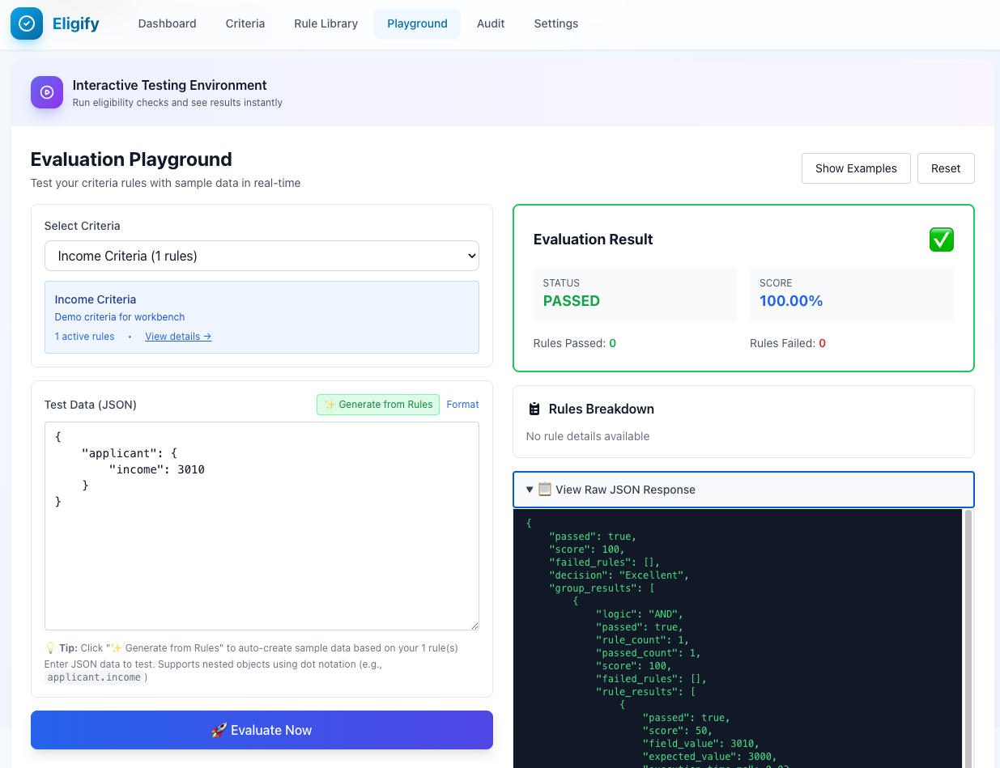

# Eligify Examples

This directory contains practical, real-world examples demonstrating Eligify's capabilities across various industries and use cases.

## 🎮 Interactive Playground

**Want to test these examples visually?**

Enable the Eligify Dashboard and use the built-in Playground:

```bash
# .env
ELIGIFY_UI_ENABLED=true
```

**Access:** `http://your-app.test/eligify/playground`



The Playground lets you:

- Load any example criteria
- Test with custom data
- See real-time evaluation results
- Debug rule-by-rule execution

> 📖 [Complete UI Setup Guide](../docs/ui-setup-guide.md)

---

## 📚 Examples Index

### Essential Examples

1. **[Loan Approval System](01-loan-approval.php)** - Financial Services
   - Credit score validation
   - Income and debt ratio checks
   - Employment verification
   - Automated approval/rejection workflows

2. **[Scholarship Eligibility](02-scholarship-eligibility.php)** - Education
   - GPA requirements
   - Financial need assessment
   - Merit-based scoring
   - Threshold-based award tiers

3. **[Job Candidate Screening](03-job-candidate-screening.php)** - Human Resources
   - Skills matching
   - Experience validation
   - Education requirements
   - Batch candidate evaluation

4. **[Insurance Underwriting](04-insurance-underwriting.php)** - Insurance Industry
   - Risk factor assessment
   - Age and health conditions
   - Premium calculation logic
   - Complex nested conditions

5. **[E-commerce Discount Eligibility](05-e-commerce-discount-eligibility.php)** - Retail
   - Loyalty program integration
   - Cart value thresholds
   - Product category rules
   - Real-time eligibility checks

### Advanced Examples

6. **[Government Aid Qualification](06-government-aid-qualification.php)** - Social Services
   - Income bracket validation
   - Family size considerations
   - Asset limit checks
   - Multi-criteria evaluation with audit logging

7. **[Gym Membership Tiers](07-gym-membership-tiers.php)** - Subscription Services
   - Age-based pricing (student, senior)
   - Attendance-based rewards
   - Dynamic tier upgrades
   - XOR logic for exclusive benefits

8. **[Credit Card Approval](08-credit-card-approval.php)** - Banking/FinTech
   - Card type eligibility (Basic, Gold, Platinum)
   - Credit utilization analysis
   - Payment history validation
   - Advanced rule engine with execution plans

9. **[Rental Application Screening](09-rental-application-screening.php)** - Property Management
   - Income-to-rent ratio validation
   - Credit and background checks
   - Rental history verification
   - Async workflow integration

10. **[SaaS Plan Upgrade Eligibility](10-saas-plan-upgrade-eligibility.php)** - Software/Technology
    - Usage metrics evaluation
    - Account tenure requirements
    - Feature adoption scoring
    - Automated upgrade recommendations

11. **[User Account Verification](11-user-account-verification.php)** - Security & Compliance
    - Account eligibility
    - Security checks
    - Verification workflows
    - Batch user evaluation

### Developer Tools Examples

12. **[Playground Sample Generator](12-playground-sample-generator.php)** - Testing
    - Generate test data
    - Interactive playground samples
    - UI integration

13. **[Model Mapping Generator](13-model-mapping-generator.php)** - Code Generation
    - Auto-generate model mappings
    - CLI command usage
    - Custom field extractors

14. **[Snapshot Usage](14-snapshot-usage.php)** - Data Handling ⭐ **NEW**
    - Type-safe data snapshot container
    - Data filtering and transformation
    - Method chaining
    - Integration with evaluation
    - Immutability benefits

## 🚀 Quick Start

### Running Examples

All examples are standalone PHP files that can be run directly:

```bash
# From the package root directory
php examples/01-loan-approval.php
php examples/02-scholarship-eligibility.php
# ... and so on
```

### Using in Your Laravel Application

Each example demonstrates how to integrate Eligify into your Laravel application:

```php
use CleaniqueCoders\Eligify\Eligify;

// Define criteria
$criteria = Eligify::criteria('your_criteria_name')
    ->addRule('field', 'operator', 'value')
    ->onPass(fn($data) => /* success action */)
    ->onFail(fn($data) => /* failure action */)
    ->save();

// Evaluate
$result = Eligify::evaluate('your_criteria_name', $data);
```

## 📖 What You'll Learn

### Basic Concepts

- ✅ Creating criteria and rules
- ✅ Using operators (>=, <=, ==, !=, in, between, etc.)
- ✅ Weighted scoring
- ✅ Pass/fail thresholds

### Intermediate Features

- ✅ Callbacks (onPass, onFail, onExcellent, onGood)
- ✅ Workflow management
- ✅ Batch evaluation
- ✅ Model integration with HasEligibility trait

### Advanced Features

- ✅ Complex rule groups (AND/OR/NAND/NOR/XOR)
- ✅ Rule dependencies
- ✅ Threshold-based decisions
- ✅ Custom scoring methods
- ✅ Audit logging
- ✅ Event listeners
- ✅ CLI commands

## 🎯 Feature Matrix

| Example | Basic Rules | Callbacks | Workflows | Groups | Batch | Model | Audit | CLI |
|---------|-------------|-----------|-----------|--------|-------|-------|-------|-----|
| 01. Loan Approval | ✅ | ✅ | ✅ | ❌ | ❌ | ❌ | ✅ | ❌ |
| 02. Scholarship | ✅ | ✅ | ✅ | ❌ | ✅ | ❌ | ✅ | ❌ |
| 03. Job Screening | ✅ | ✅ | ❌ | ✅ | ✅ | ✅ | ❌ | ❌ |
| 04. Insurance | ✅ | ✅ | ✅ | ✅ | ❌ | ❌ | ✅ | ❌ |
| 05. E-commerce | ✅ | ✅ | ✅ | ❌ | ❌ | ✅ | ❌ | ❌ |
| 06. Gov Aid | ✅ | ✅ | ❌ | ✅ | ❌ | ✅ | ✅ | ❌ |
| 07. Gym Membership | ✅ | ✅ | ✅ | ✅ | ❌ | ✅ | ❌ | ❌ |
| 08. Credit Card | ✅ | ✅ | ✅ | ✅ | ❌ | ❌ | ✅ | ✅ |
| 09. Rental Screening | ✅ | ✅ | ✅ | ✅ | ❌ | ✅ | ✅ | ❌ |
| 10. SaaS Upgrade | ✅ | ✅ | ✅ | ❌ | ✅ | ✅ | ❌ | ✅ |
| 11. User Verification | ✅ | ✅ | ❌ | ❌ | ✅ | ✅ | ❌ | ❌ |

## 💡 Tips

1. **Start Simple**: Begin with Example 01 or 02 to understand basic concepts
2. **Progressive Learning**: Examples increase in complexity - follow the order
3. **Adapt for Your Needs**: Copy and modify examples for your specific use case
4. **Test Thoroughly**: Each example includes both passing and failing test cases
5. **Check Documentation**: Refer to the main README for detailed API documentation

## 🤝 Contributing

Have a great real-world example to share? Feel free to contribute!

## 📄 License

These examples are part of the Eligify package and follow the same license.
